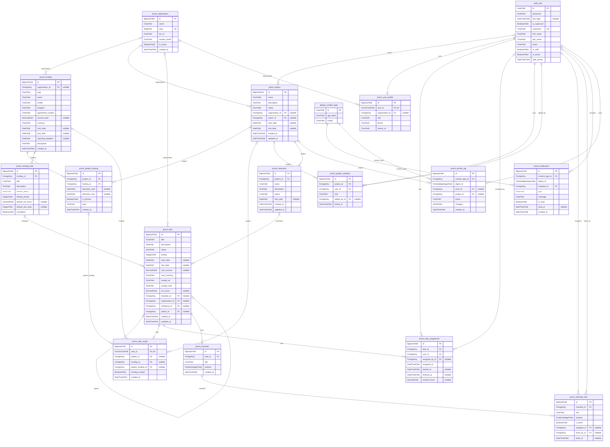

# Database ER diagram

Generated with `python manage.py generate_erd` - do not edit by hand.

```mermaid
erDiagram
    promt_funding {
        BigAutoField id PK
        ForeignKey organization_id FK "nullable"
        CharField type
        CharField name
        CharField funder
        CharField program
        CharField agreement_number
        DecimalField amount_total "nullable"
        CharField currency
        DateField start_date "nullable"
        DateField end_date "nullable"
        DateField reporting_deadline "nullable"
        TextField description
        DateTimeField created_at
    }
    promt_project_funding {
        BigAutoField id PK
        ForeignKey project_id FK
        ForeignKey funding_id FK
        DateField allocation_start "nullable"
        DateField allocation_end "nullable"
        BooleanField is_primary
        TextField note
        DateTimeField created_at
    }
    promt_funding_task {
        BigAutoField id PK
        ForeignKey funding_id FK
        CharField title
        TextField description
        CharField default_status
        IntegerField default_priority
        DecimalField default_est_hours "nullable"
        IntegerField default_due_days "nullable"
        BooleanField mandatory
    }
    promt_project {
        BigAutoField id PK
        CharField name
        TextField description
        CharField status
        ForeignKey organization_id FK "nullable"
        ForeignKey owner_id FK "nullable"
        DateField start_date "nullable"
        DateField end_date "nullable"
        DateTimeField created_at
        DateTimeField updated_at
    }
    promt_task {
        BigAutoField id PK
        CharField title
        TextField description
        CharField status
        IntegerField priority
        DateField start_date "nullable"
        DateField due_date "nullable"
        DecimalField cost_amount "nullable"
        CharField cost_currency
        CharField receipt_url
        TextField receipt_note
        DecimalField est_hours "nullable"
        ForeignKey template_id FK "nullable"
        ForeignKey organization_id FK "nullable"
        ForeignKey milestone_id FK "nullable"
        ForeignKey parent_id FK "nullable"
        DateTimeField created_at
        DateTimeField updated_at
    }
    promt_task_scope {
        BigAutoField id PK
        OneToOneField task_id FK, UK
        ForeignKey project_id FK "nullable"
        ForeignKey funding_id FK "nullable"
        ForeignKey project_funding_id FK "nullable"
        BooleanField funding_scoped
        DateTimeField created_at
    }
    promt_user_profile {
        BigAutoField id PK
        OneToOneField user_id FK, UK
        ForeignKey organization_id FK "nullable"
        CharField role
        CharField phone
        CharField avatar_url
    }
    promt_task_assignment {
        BigAutoField id PK
        ForeignKey task_id FK
        ForeignKey user_id FK
        ForeignKey assigned_by_id FK "nullable"
        DateTimeField assigned_at
        DateTimeField started_at "nullable"
        DateTimeField finished_at "nullable"
        DecimalField worked_hours "nullable"
    }
    promt_organization {
        BigAutoField id PK
        CharField name
        SlugField slug UK
        CharField tax_id
        CharField contact_email
        BooleanField is_active
        DateTimeField created_at
    }
    promt_project_member {
        BigAutoField id PK
        ForeignKey project_id FK
        ForeignKey user_id FK
        CharField role
        ForeignKey added_by_id FK "nullable"
        DateTimeField joined_at
    }
    promt_milestone {
        BigAutoField id PK
        ForeignKey project_id FK
        CharField name
        TextField description
        CharField status
        DateField due_date "nullable"
        DateTimeField created_at
        DateTimeField updated_at
    }
    promt_checklist {
        BigAutoField id PK
        ForeignKey task_id FK
        CharField title
        PositiveIntegerField position
        DateTimeField created_at
    }
    promt_checklist_item {
        BigAutoField id PK
        ForeignKey checklist_id FK
        CharField text
        PositiveIntegerField position
        BooleanField is_done
        ForeignKey assignee_id FK "nullable"
        ForeignKey done_by_id FK "nullable"
        DateTimeField done_at "nullable"
    }
    promt_notification {
        BigAutoField id PK
        ForeignKey content_type_id FK
        PositiveBigIntegerField object_id
        ForeignKey recipient_id FK
        CharField type
        CharField message
        BooleanField is_read
        DateTimeField read_at "nullable"
        DateTimeField created_at
    }
    promt_activity_log {
        BigAutoField id PK
        ForeignKey content_type_id FK
        PositiveBigIntegerField object_id
        ForeignKey actor_id FK "nullable"
        ForeignKey project_id FK "nullable"
        CharField action
        JSONField changes
        DateTimeField created_at
    }
    auth_user {
        AutoField id PK
        CharField password
        DateTimeField last_login "nullable"
        BooleanField is_superuser
        CharField username UK
        CharField first_name
        CharField last_name
        CharField email
        BooleanField is_staff
        BooleanField is_active
        DateTimeField date_joined
    }
    django_content_type {
        AutoField id PK
        CharField app_label
        CharField model
    }

    promt_organization |o--o{ promt_funding : "organization"
    promt_project ||--o{ promt_project_funding : "project"
    promt_funding ||--o{ promt_project_funding : "funding"
    promt_funding ||--o{ promt_funding_task : "funding"
    promt_organization |o--o{ promt_project : "organization"
    auth_user |o--o{ promt_project : "owner"
    promt_funding_task |o--o{ promt_task : "template"
    promt_organization |o--o{ promt_task : "organization"
    promt_milestone |o--o{ promt_task : "milestone"
    promt_task |o--o{ promt_task : "parent"
    promt_task ||--o| promt_task_scope : "task"
    promt_project |o--o{ promt_task_scope : "project"
    promt_funding |o--o{ promt_task_scope : "funding"
    promt_project_funding |o--o{ promt_task_scope : "project_funding"
    auth_user ||--o| promt_user_profile : "user"
    promt_organization |o--o{ promt_user_profile : "organization"
    promt_task ||--o{ promt_task_assignment : "task"
    auth_user ||--o{ promt_task_assignment : "user"
    auth_user |o--o{ promt_task_assignment : "assigned_by"
    promt_project ||--o{ promt_project_member : "project"
    auth_user ||--o{ promt_project_member : "user"
    auth_user |o--o{ promt_project_member : "added_by"
    promt_project ||--o{ promt_milestone : "project"
    promt_task ||--o{ promt_checklist : "task"
    promt_checklist ||--o{ promt_checklist_item : "checklist"
    auth_user |o--o{ promt_checklist_item : "assignee"
    auth_user |o--o{ promt_checklist_item : "done_by"
    django_content_type ||--o{ promt_notification : "content_type"
    auth_user ||--o{ promt_notification : "recipient"
    django_content_type ||--o{ promt_activity_log : "content_type"
    auth_user |o--o{ promt_activity_log : "actor"
    promt_project |o--o{ promt_activity_log : "project"
```
